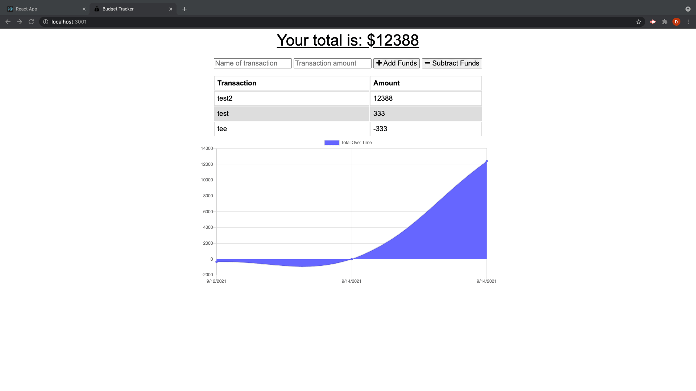
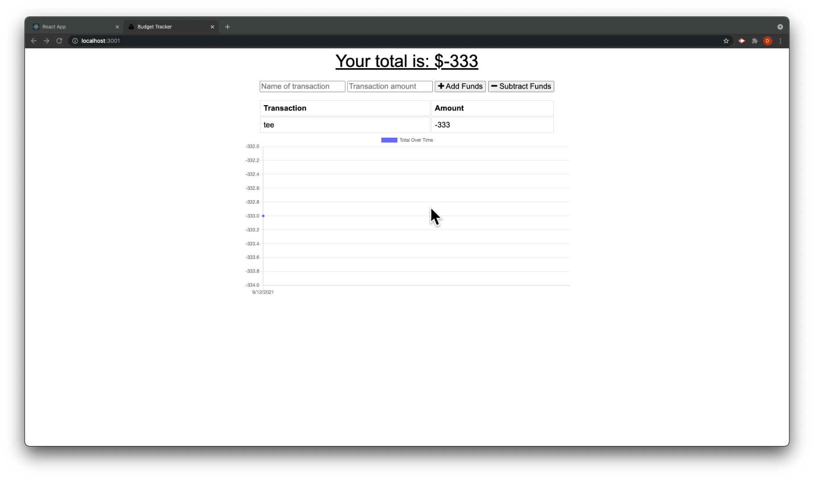

# Budget Tracker


### _Progressive Web Application_

<br>

## Table of Contents

- [Description](#description)
- [Installation](#installation)
- [Purpose](#purpose)
- [Contributing](#contributing)
- [Issues](#issues)
- [Tests](#tests)
- [Links](#links)

## Description

This is a program that allows someone to track, update and edit a user's account information while offline. The program run in the browser or installed on the device of choice. Using Node.js, MongoDB and Express.js, to create a simple but feature rich PWA. There are a few other dependecies added to enhance the functionality .

## Installation

To develop this app further you must install [Node.js](https://nodejs.org/en/). Once you have Node.js installed, then install Node Package Manager(npm).

first...

```
npm init -y
```

then...

```
npm install express mongoose morgan compression
```

The user will have the ability to download and install the app natively.

## Purpose

Keeping track of your information is difficult enough. Now imagine a terrible storm and you are without internet or poor quality service for a period of time. Now imagine you have the capability to conduct offline financial transactions. Explore the world of PWA techonolgy.

## License


<br />
This application is not currently covered by any license, but was crafted with the open source community in mind.

## Contributing

With support and assistance from the developer community at large.

## Issues

There may be slight challenges with all functionality as of initial deployment

## Testing

<figure class="video_container">

<!-- blank line -->
<figure class="video_container">
  <iframe src="https://www.youtube.com/embed/D2gYvSss9QU" frameborder="0" allowfullscreen="true"> </iframe>
</figure>
<!-- blank line -->

## Links



[Budget Tracker App](https://warm-lowlands-12680.herokuapp.com/)

[Budget Tracker App Demo](./public/img/Budget-Tracker.mov)

<!-- blank line -->
<figure class="video_container">
  <video controls="true" allowfullscreen="true" poster="./public/img/budget-tracker-pic3-min.png" style="width:400px " >
    <source src="./public/img/Budget-Tracker.mov" type="video/mp4">
    
  </video>
</figure>
<!-- blank line -->
